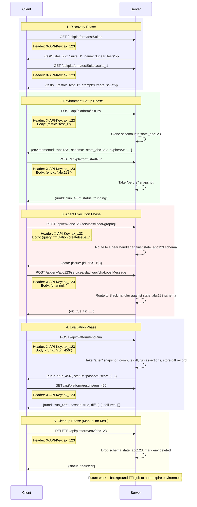

```mermaid
sequenceDiagram
    participant Client
    participant Server

    rect rgb(240, 240, 255)
        Note over Client, Server: 1. Discovery Phase
        Client->>Server: GET /api/platform/testSuites
        Note right of Client: Header: X-API-Key: ak_123
        Server->>Client: {testSuites: [{id: "suite_1", name: "Linear Tests"}]}
        Client->>Server: GET /api/platform/testSuites/suite_1
        Note right of Client: Header: X-API-Key: ak_123
        Server->>Client: {tests: [{testId: "test_1", prompt:"Create issue"}]}
    end

    rect rgb(240, 255, 240)
        Note over Client, Server: 2. Environment Setup Phase
        Client->>Server: POST /api/platform/initEnv
        Note right of Client: Header: X-API-Key: ak_123<br/>Body: {testId: "test_1"}
        Server->>Server: Clone schema into state_abc123
        Server->>Client: {environmentId: "abc123", schema: "state_abc123", expiresAt: "..."}

        Client->>Server: POST /api/platform/startRun
        Note right of Client: Header: X-API-Key: ak_123<br/>Body: {envId: "abc123"}
        Server->>Server: Take "before" snapshot
        Server->>Client: {runId: "run_456", status: "running"}
    end

    rect rgb(255, 240, 240)
        Note over Client, Server: 3. Agent Execution Phase
        Client->>Server: POST /api/env/abc123/services/linear/graphql
        Note right of Client: Header: X-API-Key: ak_123<br/>Body: {query: "mutation createIssue..."}
        Server->>Server: Route to Linear handler against state_abc123 schema
        Server->>Client: {data: {issue: {id: "ISS-1"}}}

        Client->>Server: POST /api/env/abc123/services/slack/api/chat.postMessage
        Note right of Client: Header: X-API-Key: ak_123<br/>Body: {channel: "#general", text: "..."}
        Server->>Server: Route to Slack handler against state_abc123 schema
        Server->>Client: {ok: true, ts: "..."}
    end

    rect rgb(240, 240, 255)
        Note over Client, Server: 4. Evaluation Phase
        Client->>Server: POST /api/platform/endRun
        Note right of Client: Header: X-API-Key: ak_123<br/>Body: {runId: "run_456"}
        Server->>Server: Take "after" snapshot, compute diff, run assertions, store diff record
        Server->>Client: {runId: "run_456", status: "passed", score: {...}}

        Client->>Server: GET /api/platform/results/run_456
        Note right of Client: Header: X-API-Key: ak_123
        Server->>Client: {runId: "run_456", passed: true, diff: {...}, failures: []}
    end

    rect rgb(255, 255, 240)
        Note over Client, Server: 5. Cleanup Phase (Manual for MVP)
        Client->>Server: DELETE /api/platform/env/abc123
        Note right of Client: Header: X-API-Key: ak_123
        Server->>Server: Drop schema state_abc123, mark env deleted
        Server->>Client: {status: "deleted"}
    end

    Note over Server: Future work – background TTL job to auto-expire environments
```

